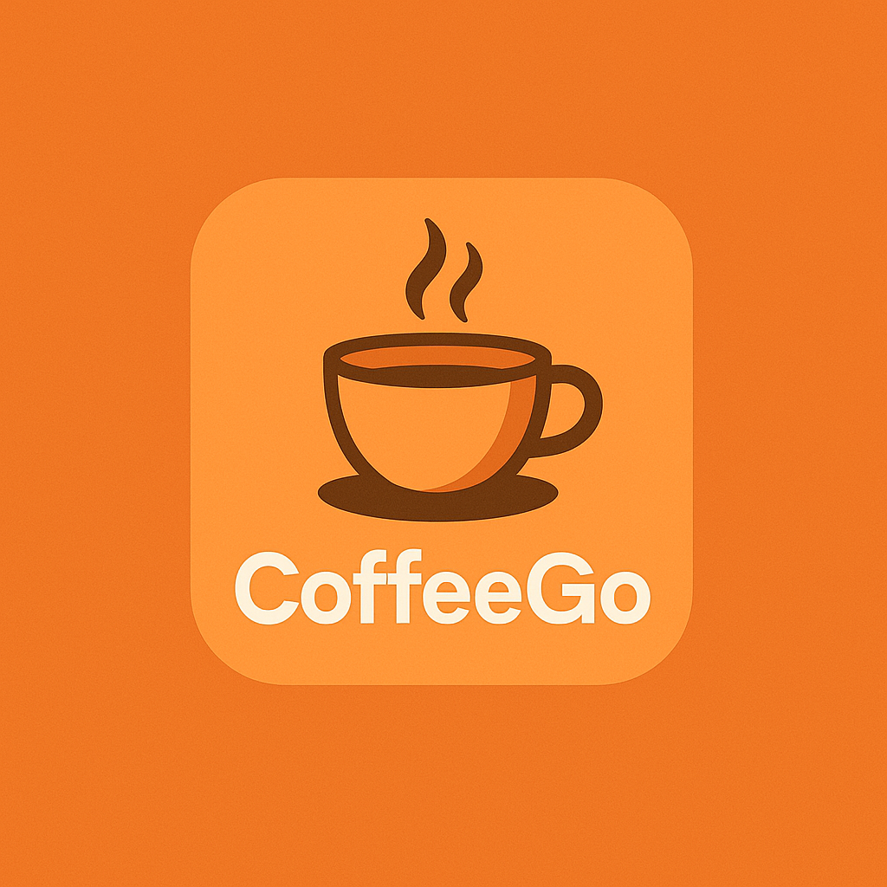

<p align="center">
  
</p>

<h1 align="center">CoffeeGo</h1>

<p align="center">
  <b>Aplicación móvil y web para la tus pedidos dentro de tu cafeteria favorita</b><br/>
  Desarrollada con <a href="https://ionicframework.com/">Ionic</a> + <a href="https://nodejs.org/">Node.js</a> + <a href="https://www.mysql.com/">MySQL</a>
</p>

---

## 📚 Índice

1. [Introducción](#-introducción)
2. [Características](#-características)
3. [Instalación](#-instalación)
4. [Instalación para desarrolladores](#-instalación-para-desarrolladores)
5. [Uso de la aplicación](#-uso-de-la-aplicación)
6. [Preguntas frecuentes](#-preguntas-frecuentes)
7. [Créditos y soporte](#-créditos-y-soporte)
8. [Tecnologías usadas](#-tecnologías-usadas)

---

## ✨ Introducción

**CoffeeGo** es una aplicación móvil y web diseñada para realizar pedidos en las cafeterias como starbacks viendo la carta que tiene teniendo una parte para poner cualquier nota al pedido que quieras realizar para no estar esperando y ver como va tu pedido en todo momento una vez tu cafe o cualquier otro producto este listo te saltara una notificación para poder recogerlo sin necesidad de estar esperando al frente de la barra si no en tu mesa realizando cualquier otra cosa.

Necesitas registrarte como cliente de ese lugar teniendo que iniciar sesion para poder disfrutar de la experiencia

Permite tanto a administradores como a usuarios acceder a funciones específicas según su rol:

- 🧑‍💼 **Administrador**: puede gestionar el inventario, ver pedidos y administrar clientes.
- 🧑‍💼 **barista** : puede ver los pedidos de los cliente y realizar los cambios de estados de los mismos.  
- 🚴 **Cliente**: puede explorar el catálogo, consultar novedades, ver detalles de productos y realizar compras.

---

## ✨ Características

- 🔐 Registro e inicio de sesión seguros con encriptación  
- 🚴 Pedido de productos a tiempo real  
- 🏷️ Filtros por categoria o nombre del producto  
- 🔔 Notificaciones una vez terminado el pedido  
- 💎 Interfaz moderna, minimalista y responsive  

---

## ⚙️ Instalación

> ⚠️ **Actualmente la aplicación no cuenta con un archivo `.apk` para Android ni dominio web disponible.**

Una vez completada la versión final, se incluirán los pasos de instalación y los enlaces correspondientes.

---

## 👨‍💻 Instalación para desarrolladores

## 📦 Requisitos previos

Asegúrate de tener instalados los siguientes componentes:

- [Node.js](https://nodejs.org/)
- [Ionic Framework](https://ionicframework.com/)
- [MySQL](https://www.mysql.com/)

---

## 🚀 Pasos de instalación

1. **Clona este repositorio:**
   ```bash
   git clone https://github.com/Escadi/coffeeGo_app.git
   ```
2. Instala las depencias en el backend
   ```bash
   cd backend
   npm install
   ```
3. Backend – iniciar el servidor Node.js:
   ```bash
   cd backend
   node index.js
   ```
   -abrimos otro terminal dentro del IDE-
4. Frontend - ejecutar la app en ionic
   ```bash
   cd frontend
   ionic serve
   ```
5. Una vez iniciado , se abrira automaticamente en tu navegador
   para una mejor experiencia , presiona CTRL + SHIFT + i para activar la vista movil
---
## 📱 Uso de la aplicación
🚧 Actualmente la aplicación se encuentra en construcción.
Algunas funciones pueden no estar disponibles o sujetas a cambios.

**Funcionalidades Activas**

1. ***Iniciar sesión*** – acceso básico con autenticación.
   
2. ***Gestionar productos*** – visualizar , eliminar , modificar .
   
3. ***Añadir nuevo producto*** – formulario para registrar nuevos productos.

4. ***Editar información*** – modificar datos existentes de productos y clientes.

---

## ❓ Preguntas frecuentes

**1. ¿Se necesita conexión a internet?**

Sí, es necesaria para cargar los productos y realizar pedidos.

**2. ¿Puedo probar la app sin registrarme?**

No, tienes que estar registrado para disfrutar de la experiencia.

**3. ¿Habrá versión móvil oficial?**

Sí, se publicará un .apk cuando finalice la fase de pruebas.


---
## 🛠️ Tecnologías usadas
| Tecnología                                     | Descripción                               |
| ---------------------------------------------- | ----------------------------------------- |
| [Ionic Framework](https://ionicframework.com/) | Framework para desarrollo web y móvil     |
| [Node.js](https://nodejs.org/)                 | Entorno de ejecución backend              |
| [MySQL](https://www.mysql.com/)                | Base de datos relacional                  |
| [Postman](https://www.postman.com/)            | Herramienta para probar y documentar APIs |

📄 Colección Postman:

https://documenter.getpostman.com/view/48544649/2sB3QGvC3a

---
## 🚧 Estado del proyecto

|      Estado      | Versión | Última actualización |
| :--------------: | :-----: | :------------------: |
| 🧪 En desarrollo |  1.0.0  |     Octubre 2025     |

---
## 👥 Créditos y soporte

· Desarrollado por: Escadi

· Contacto: 📧 escadidev@gmail.com
<p align="center"> 
  <br/>
  <b>
    Coffee Shop
  </b>. </p> 

